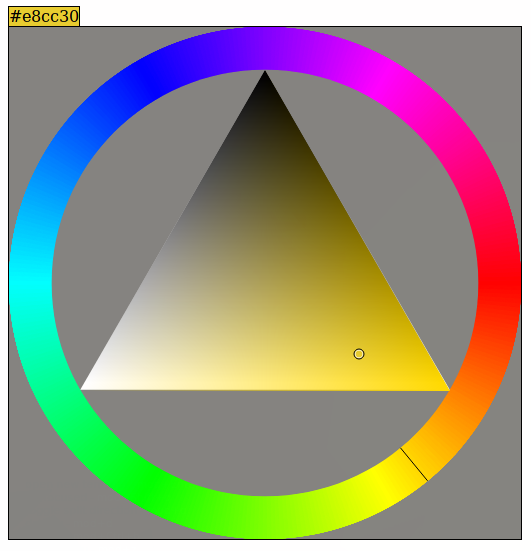

# Javascript HSV Colour Picker



HSV colour picker for the web, using HTML5 canvas. Provides a simple `ColourPicker` constructor, which takes arguments for a callback and the size of the canvas. A minimal complete example is in `picker.html` (live demo at https://tobsta.github.io/ColourPicker/picker.html)

Note: this depends on [TinyColor](https://github.com/bgrins/tinycolor).

## Basic Example

```html
<span>[hex code]</span>
<div class='picker'></div>
<script src='https://cdnjs.cloudflare.com/ajax/libs/tinycolor/1.4.1/tinycolor.min.js'></script>
<script src='colour-picker.js'></script>
<script>
const el = document.querySelector('span');
const picker = new ColourPicker(colour => {
	el.style.backgroundColor = colour.toHslString();
	el.innerText = colour.toHexString();
	el.style.color = colour.isDark() ? 'white' : 'black';
}, 512);
document.querySelector('.picker').appendChild(picker.element);
</script>
```
